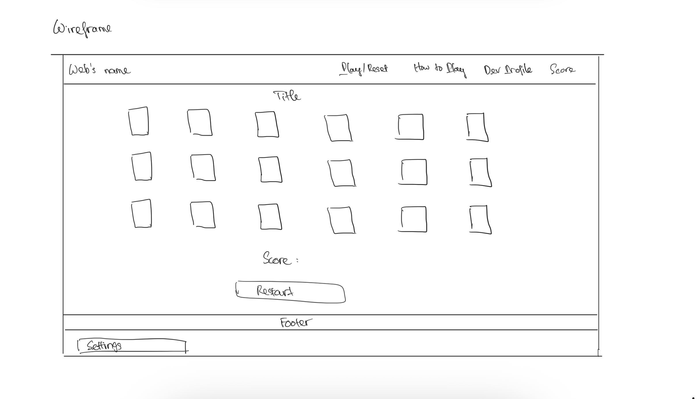
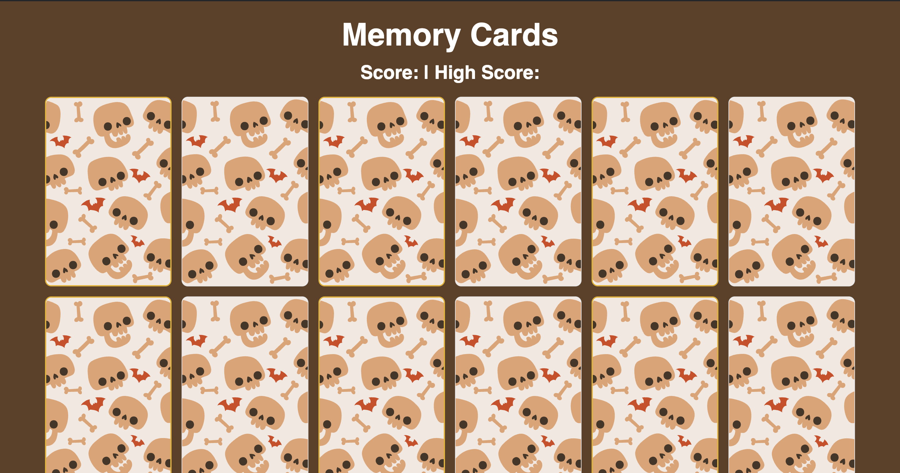

# Memory Cards Game – Nhu Tran

📅 13 October 2025

---

## 📖 Overview
This is a simple web-based Memory Cards game where players match pairs of animal cards.  
The game demonstrates modern JavaScript (ES modules), responsive CSS Grid, Bootstrap 5 components, and state persistence using Web Storage.

Players can track their **Score** and **High Score**, restart the game, and change the theme. A settings form allows the player to save their name and preferred theme.

---

## 🖼️ Wireframe
The wireframe shows the initial sketch of the game layout, including the grid of cards, score display, restart button, and settings form.  



---

## 🚀 How to View
**Live Game:** [Play Memory Cards Game](https://nhu-tran1105.github.io/Bravo/)  
**Source Code:** [GitHub Repo](https://github.com/nhu-tran1105/Bravo)

---

## 💻 Game Rules
1. Click on a card to flip it over.  
2. Flip a second card to try to find a matching pair.  
3. If the cards match, your **score increases**.  
4. If they do not match, they flip back automatically.  
5. The game continues until all pairs are matched.  
6. Click **Restart** to start a new game.  
7. The **High Score** persists between sessions.

---

## 🛠️ Technologies Used
- HTML5 (semantic layout, landmarks)
- CSS3 (Grid layout, responsive design, CSS variables, advanced selectors)
- Google Fonts (Poppins)
- Bootstrap 5 (Navbar, Buttons, Modal)
- JavaScript ES Modules (game logic and storage)
- Web Storage API (localStorage for high score)
- Accessibility support (aria-live for score, WAVE-friendly)

---

## 🖼️ Screenshot


---

## 💻 Code Snippet
Below is a key function from the game logic — it checks for matching cards and updates the score using localStorage and cookies:

```javascripts
function disableCards() {
  firstCard.removeEventListener("click", flipCard);
  secondCard.removeEventListener("click", flipCard);
  score++;
  scoreElement.textContent = score;

  const highScoreElement = document.querySelector(".high-score");
  saveScore(score);
  highScoreElement.textContent = getHighScore();

  const playerName = localStorage.getItem("playerName") || "Guest";
  savePlayerStats(playerName, score);
  checkWin(); 
  resetBoard();
}
```

---

## Explanation:
This function runs when two flipped cards match. It:
1. Disables further clicks on the matched pair
2. Increases and displays the score
3. Updates the high score using localStorage
4. Saves player stats (name and score) as a cookie
5. Checks if the player has completed all pairs

---

## Credit & Disclosure

**Author:** Nhu Tran  

**Tools Used:**  
- **Bootstrap 5** – for responsive layout, Navbar, buttons, modal.  
- **Normalize.css** – for consistent styling across browsers.  
- **Google Fonts (Poppins)** – custom font for headings and text.  
- **JavaScript ES Modules** – modular game logic and storage functions.  
- **Web Storage API** – localStorage to persist high score.  

**Wireframe:** Created using hand-drawn sketch or digital drawing and saved to `/images/wireframe.png`.  

**Disclosure:**  
This project is built as a personal learning project and portfolio piece. All images of animals, patterns, and other assets are free to use or created by the author. No copyrighted material from other sources is used without permission.
